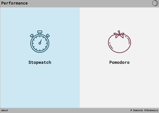
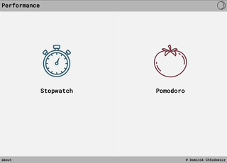
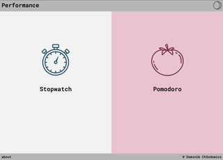

# performance_app - pomodoro app
                    
## General info
               
The purpose of this app is to enhance your study concentration and track your productive hours. 
It features two sections - a stopwatch and a pomodoro timer.

## Technologies
Project is created with:
* Python3 
* Flask
* Javascript
* SQLite3
* HTML5
* CSS3

## Two sections


## Pomodoro


## Stopwatch


## Night mode


## Setup
To run this app on your local server, simply download it and change to its directory.
Then install all the needed python dependencies using pip command below.
Run the project using flask run

```console
$ cd /performace_app
$ python3 -m venv ./venv
$ pip install -r ./requirements.txt
$ . ./venv/bin/activate
$ $ flask --app performance_app run
```